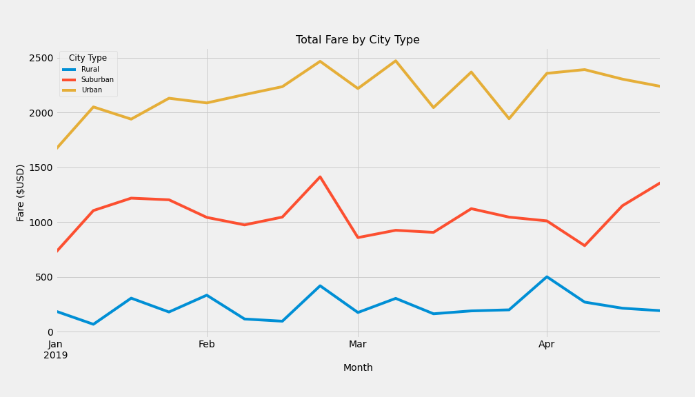

# PyBer Analysis

## Overview of the Analysis:

Create visualizations of rideshare data for PyBer to help improve access to ride-sharing services and determine affordability for underserved neighborhoods.
Using the Python graphing library Matplotlib, visualization features. Matplotlib was created as a Python alternative for MATLAB. MATLAB, which is short for matrix laboratory, was developed by the company MathWorks in the 1980s. It enabled scientists to perform linear algebra and numerical analysis without learning the programming language Fortran, which until then had been the best option for complex computations. Matplotlib is a graphing and plotting library for Python that comes with the Anaconda installation. To use it with Jupyter Notebook, all we need to do is import it. Matplotlib is often used with another Python library, NumPy, a numerical mathematics library for making arrays or matrices. A matrix is a two-dimensional data structure, or a list of lists, in which numbers are arranged into rows and columns. Create and annotate vertical and horizontal bar charts.
 
### Purpose:

Analyze all the rideshare data from January to early May of 2019 and create visualization charts of the data.

## Resources

**Data Source:** city_data.csv, ride_data.csv.

**Software:** Jupyter, Python graphing library Matplotlib.

## Results:

The multiple-line chart "Total Fare by City Type" presents trends of total fares in rural, suburban, and urban cities during January and April 2019. The yellow trend line represents fares in urban cities totaling from $1,600 to $2,300 during the five-month period. The blue trend line represents fares in rural cities totaling about $300 during the same time period. The orange trend line represents fares in suburban cities totaling $700 to $1,300 during the same time period. The chart demonstrates similar trends for all types of cities. Urban, suburban, and rural cities experienced a similar peak trend during the end of February.

	

## Summary:

- There is higher demand for PyBer ridesharing in urban cities, vs suburban or rural areas.

- There are more available drivers in urban cities than in rural areas.

- PyBer's main revenue source comes from urban cities with higher demand for ride sharing services.

- PyBer riders in rural areas pay more per fare than riders in urban or suburban cities. 

- Drivers in rural areas are earning more than drivers in urban cities. 

- Travel distance can be a determining factor for the higher cost of rural fares.

